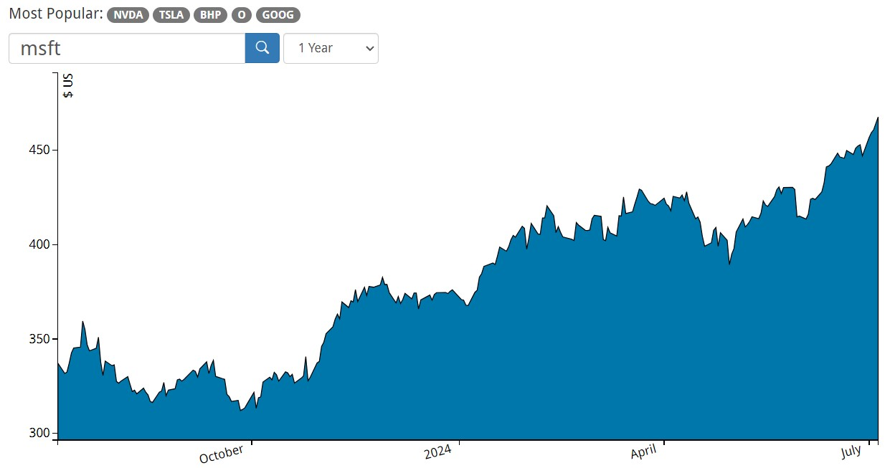
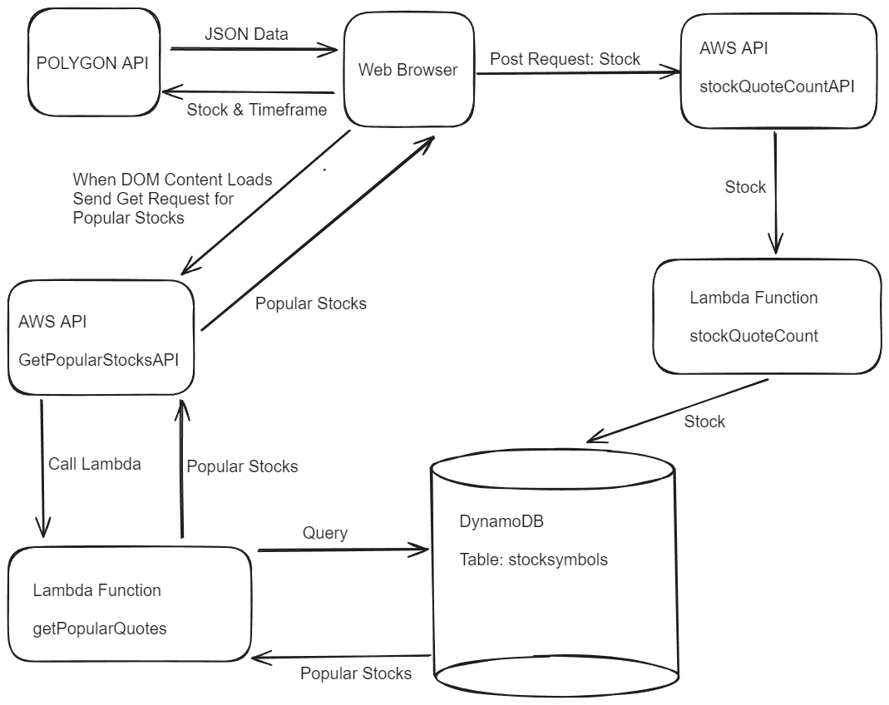
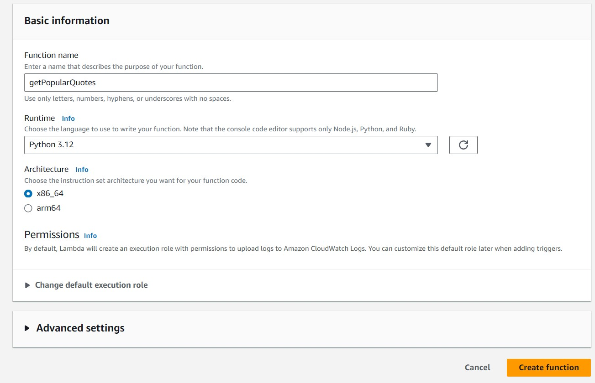
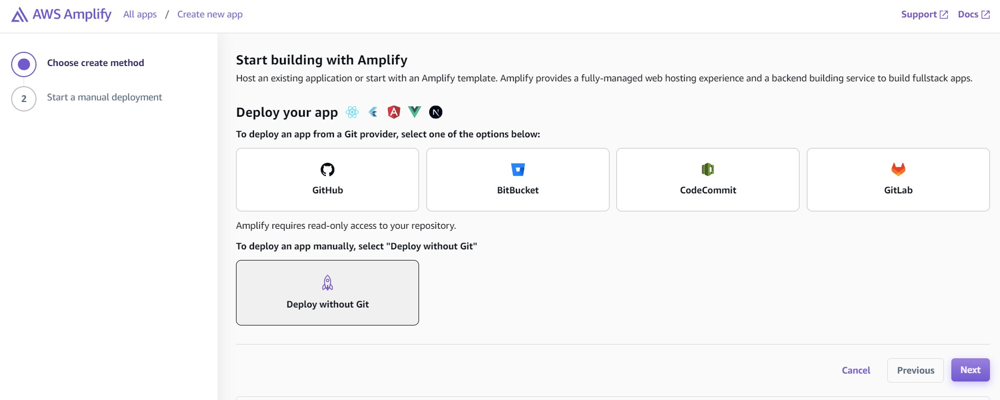

# StockChart
## Important Note
The objective of this Readme is **TO SHOW YOU HOW TO SET UP THE AWS CLOUD 
RESOURCES** to save user-inputted stock symbols to the cloud and then 
retrieve the most popular stock symbols to display them.

## Introduction

StockChart is a web application that takes a stock symbol and a 
time frame as user input to send to [Polygon.io](https://www.polygon.io/). 
This third party API, [Polygon.io](https://www.polygon.io/), returns stock 
prices for each trading day in the time frame.

StockChart receives the data 
from [Polygon.io](https://www.polygon.io/) consisting of dates and stock 
prices for that stock symbol. StockChart draws the line graph plotting 
the stock price for the time frame.

This web application consists of Vanilla JavaScript.  The stock chart is 
created using [D3.js](https://d3js.org/). If the window size of the browser 
changes the graph will redraw itself without resubmitting the query.

Behind the scenes, the stock symbols inputted by the user are saved to the 
cloud.  When the website loads it gets the most popular stocks that previous 
users have entered on the site and displays those symbols.

### Cloud Connection

User-inputted stock symbols that successfully come back with data from the 
third party [Polygon.io](https://www.polygon.io/) API are then sent to my 
AWS API. That API sends the data to my Lambda function that sends the 
stock symbol my DynamoDB table in AWS.  If the symbol exists it is 
incremented, else it is added.

As mentioned previously, when the page loads a POST request is sent to another
AWS API that I created. That API calls my other Lambda function that 
queries the DynamoDB table and gets the most popular stock symbols 
that have been stored.




## Overview of Steps
1. CREATE LAMBDA FUNCTION to save user-inputted stock symbol to cloud NoSQL database
2. INVOKE LAMBDA FUNCTION by creating an API using AWS API Gateway that calls the lambda function
3. CREATE NOSQL DYNAMODB DATABASE to store user-inputted stock symbols
4. GRANT LAMBDA FUNCTION permission to write to the database using IAM
5. CREATE LAMBDA FUNCTION to retrieve most popular user-inputted stock symbols from the NoSQL database
6. GRANT LAMBDA FUNCTION permission to read from NoSQL database using IAM
7. INVOKE LAMBDA FUNCTION by creating another API using API Gateway that calls the Lambda function
8. INSERT AWS API Calls in your JavaScript

### Coming Soon...

9. REQUEST Certificates from AWS Certificate Manager (ACM)
10. PROVISION Cloudfront service such that it use the certificates
11. CREATE corresponding CNAME and A records to Route53





## Create Lambda Function to save user-inputted stock symbol to cloud NoSQL database
This is serverless code that runs in response to a trigger. This code saves the symbol to a DynamoDB table
It also keeps track of the count
1. In AWS Console, Click on Lambda
2. Click "Create Function"
3. Choose "from Scratch"
4. Enter function name
5. For Runtime environment, choose Python 3.9
   - We are using Python so we can use the Boto3 library in the next step
6. Leave the rest of the field(s) as default
7. Click "Create Function"



8. Paste the code below. We ensure that the the Lambda function receives the stock symbol

```Python
import json
import math

# Define the handler function that the Lambda service will use an entry point
def lambda_handler(event, context):

    #Extract Stock Symbol
    res = event['stocksymbol']
    # Return a properly formatted JSON object
    return {
    'statusCode': 200,
    'body': json.dumps('Use Input is ' + res)
    }
```

9. Deploy
    - Make note of the ARN, You will need to refer to it later
10. Test it - click on drop down arrow next to Test button
11. Click Configure test event
12. Create new event, event name, private
13. Enter key value pairs:

```Python
{
  "stocksymbol": "AAPL"
}
```

14. Click Save
15. Click test button
16. Return code should be 200 and "Body" must the test stock symbol of AAPL

The NoSQL DynamoDB table has two columns: stocksymbol and count. 

17. Replace what you have in the lambda function with this
```Python
import json
import boto3

dynamodb = boto3.resource('dynamodb')

pkey = 'stocksymbol'

quoteCount = 'count'

def insertOrUpdateQuoteTable(string):
    table = dynamodb.Table('<YOUR_DYNAMODB_TABLE_NAME>')

# We use ExpressionAttributeNames because count is a reserved word and that is a column name also
# I mistakenly named a column as count
# if the symbol doesn't exist it addes it to the table, else it increments the count by one
    response = table.update_item(
        Key = {pkey: string},
        UpdateExpression = 'SET #count = if_not_exists(#count, :init) + :val',
        ExpressionAttributeNames = {'#count': quoteCount },
        ExpressionAttributeValues = {':val': 1, ':init': 0 },
        ReturnValues='UPDATED_NEW'
    )
    if 'Attributes' not in response:
        table.put_item(
            Item={pkey: string, quoteCount: 1}
        )

def lambda_handler(event, context):

# extract the two numbers from the Lambda service's event object
    stksym = event['stocksymbol']

# write result and time to the DynamoDB table using the object we instantiated and save response in a variable
    insertOrUpdateQuoteTable(stksym)

# return a properly formatted JSON object
    return {
        'statusCode': 200,
        'body': json.dumps('Stock Symbol ' + str(stksym) + ' added to Database successfully.')}
```

18. Click Deploy

## Invoke Lambda Function by creating an API using AWS API Gateway

We can trigger call the lambda function
1. In AWS Console, Click on API Gateway
2. Click "Create API"
3. Scroll down - Under REST API category , Click "Build"
4. Choose New API
5. Enter API name
6. Click "Create API"
7. Click on "Resources" on left menu
8. Click on "/" and click "Create Method" in the Methods section on right
9. For Method Type, choose "POST"
10. For Integration Type , choose "Lambda Function"
11. Choose the Lambda Function from the drop down 
12. You will see the lambda function you created earlier
13. Click "Create Method"
14. On Post Method Execution Screen (Diagram), Click on "/"
15. Click Enable CORS in the RESOURCE DETAILS section on right
16. Check the checkbox for "POST" that is besides "OPTIONS"
17. Click Save (Amplify & lambda may run in different domains 
    - So we can work across the 2 domains)
18. Click on "POST" under Resources
19. In diagram screen "Post - Method Execution", Click "Post"
20. -Click "Deploy API"
21. For Deployment State, choose NEW STAGE, give a stage name
22. Click "Deploy"
23. To Test the API:
    - Click on "Resources" in left column
    - Click on "Post"
    - On "/ - Post Method Execution" screen click "Test" tab
    - Scroll down, In request body , paste: {"stocksymbol" : "AAPL"}
    - Click "Test"
24. Click on "Stages" on the left column and make sure the created stage is highlighted
25. Under Stage details, copy or make note of the Invoke URL as this will be used from the HTML


## Create NoSQL DynamoDB database to store user-inputted stock symbols
The idea is to save the symbol and increment the count if the symbol is entered again. Obviously,
if the symbol has been entered for the first time the count will be one.

1. Open the AWS Console
2. Go to DynamoDB, click "Create table"
3. Enter table name, Partition Key
4. Enter "ID", use default settings
5. Click create table to create the table
   - In the table listing that appears afterwards, make sure that you click on the table that 
     you just created and make note of the ARN.
   - The ARN falls under the General Information section.
   - Copy the ARN to notepad or save it because we will need it later

## Grant Lambda function permission to write to the database using IAM
1. Open the AWS Console
2. Click "Lambda" 
3. Click on the lambda function you created earlier
4. Click Configuration section
5. Click on Permissions on left side menu
6. Under Execution Role > Role name, click on the link provided
7. Click on the "Add Permissions" button, in dropdown click Create inline policy
8. Click on JSON tab and paste the following:

```JSON
{
	"Version": "2012-10-17",
	"Statement": [
		{
			"Sid": "VisualEditor0",
			"Effect": "Allow",
			"Action": [
				"dynamodb:PutItem",
				"dynamodb:DeleteItem",
				"dynamodb:GetItem",
				"dynamodb:Scan",
				"dynamodb:Query",
				"dynamodb:UpdateItem"
			],
			"Resource": "<INSERT-YOUR-TABLE-ARN-HERE>"
		}
	]
}
```
9. Replace the placeholder with the ARN that you saved earlier
10. Click review policy
11. Enter policy Name
12. Click Create Policy

## Retrieve the most popular user-inputted stock symbols
1. Create Lambda function as described earlier
2. Paste this code to retreive the 5 most popular stocks from the DynamoDB table

```Python
import json
import boto3

dynamodb = boto3.resource('dynamodb')
def getTopEntries():
    table = dynamodb.Table('<YOUR_DATABASE_TABLE_NAME>')
    response = table.scan(
        ProjectionExpression = "#cnt, stocksymbol",
        ExpressionAttributeNames = {'#cnt': 'count'})
    sorted_items = sorted(response['Items'], key=lambda x: x['count'], reverse=True)
    top_five = sorted_items[:5]
    for item in top_five:
        print(item)
    return top_five

def lambda_handler(event, context):
    tqList = getTopEntries() # a list of dictionaries was returned
    listOfTuples = [] # Create an empty list,
               # it will populate with tuples [(symbol, count), (symbol, count)]
    tkey = "" # temporary key to be a part of a pair
    tvalue = "" # temporary value to be a part of a pair
    for aDict in tqList:
        for k,v in aDict.items(): #items(): each key value pair as a tuple
            tkey = k
            if 'decimal' in str(type(v)):
                tvalue = str(v)
            else:
                tvalue = v
            listOfTuples.append((tkey,tvalue))
    listOfLists = [list(t) for t in listOfTuples]
    json_string = json.dumps(listOfLists)
    print("json string - >")
    print(json_string)
    return {
        'statusCode': 200,
        'body': json_string
    }
```

3. Grant permission for the lambda function to read from the database
4. Create another API using API Gateway that invokes the Lambda function

## Insert AWS API Calls in your JavaScript

1. Insert the API Gateway Endpoint in to your JavaScript code for saving an entered stock symbol to the DynamoDB database
```JavaScript
const saveTickerToDB = (tickerToSave) => {
    let myHeaders = new Headers();
    myHeaders.append("Content-Type", "application/json");
    let packagedInput = JSON.stringify({"stocksymbol" : tickerToSave});
    let requestOptions = {method: 'POST',headers: myHeaders,body: packagedInput,redirect: 'follow'};
    fetch("<YOUR-API-URL>", requestOptions)
    .then(response => response.text())
    .then(result => console.log("Saved Ticker Symbol " + tickerToSave + " to DB."))
    .catch(error => console.log('Error saving ticker symbol ' + tickerToSave, error));
};
```

2. Insert the API Gateway Endpoint in to your JavaScript code for getting the most popular stock symbols
```JavaScript
//retrieve data from AWS getPopularQuotes API to retreive the five most 
//popular stock quotes with the number of times they have been queried
const recvPopularQuotes = (data) => {
    console.log("most popular stocks...");
    obj = JSON.parse(data.body);
};

document.addEventListener('DOMContentLoaded', function() {
    let requestOptions = {method: 'GET',redirect: 'follow'};
    fetch("<YOUR-API-URL>", requestOptions)
        .then(response => {
            if (!response.ok) {
                throw new Error('Network response was not ok');
            }
            return response.json();
        })
        .then(data => recvPopularQuotes(data))
        .catch(error => console.log('error', error));
});
```
## Create an app using AWS Amplify to launch the whole web application
1. In AWS Console, Click on AWS Amplify
2. Click on Create New App
3. Choose how to get your code
   - Select "Deploy without Git provider" and click "Next" 
   - OR Select a repository: Github, BitBucket, CodeCommit, GitLab and click "Next"

4. If you chose "Deploy without Git provider", then follow:
   - Enter an App Name and Branch Name
   - Choose Either "Drag and Drop", Amazon S3 or Any URL
   - Then, either drag and drop a zipped project .zip file OR
   - OR Specify the S3 Bucket and the ZIP file in that bucket
   - OR Specify the site URL
   - Scroll down and click "Save and Deploy"
5. If you chose a Git provider, then follow:
   - A popup will appear, enter your credentials for that Git Provider and click "Sign in"
   - Choose the Repository and Branch, then click "Next"
   - Under App settings, enter app name and click, leave rest default, "Next"
   - Click Save and Deploy, after a minute or so you will get a URL
   - Save that URL
